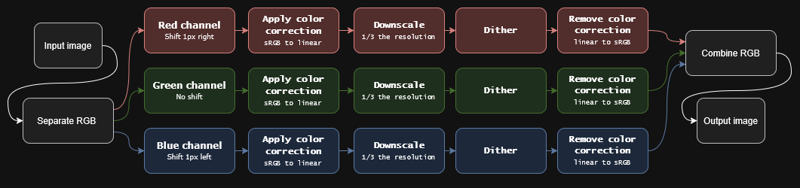
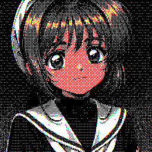
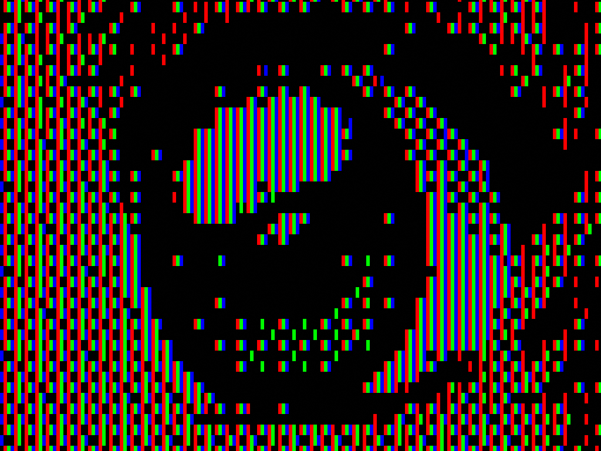
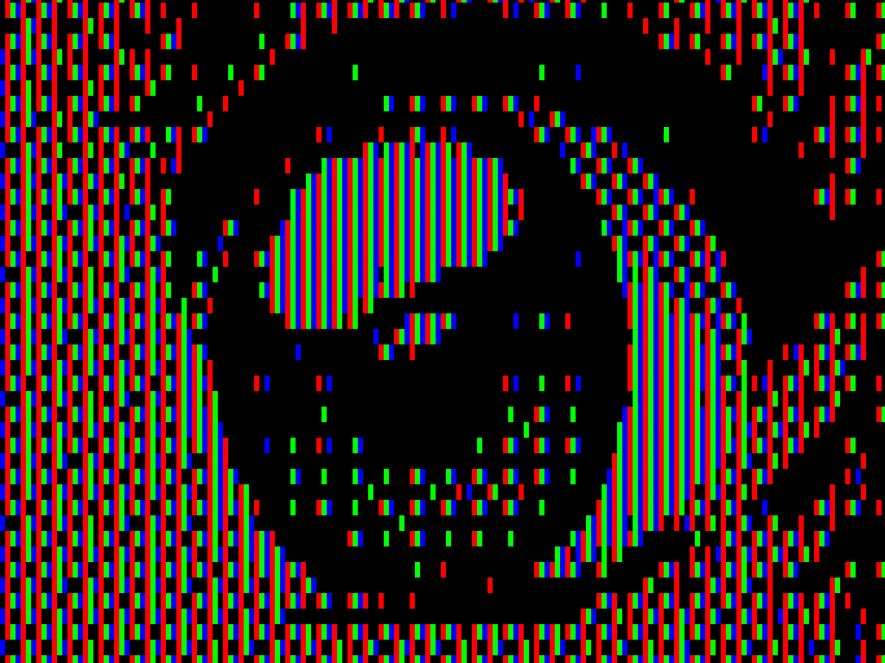

# Sub-Pixel Dithering
 
Experimental image processing project exploring what ordered (Bayer) dithering looks like when applied **per sub-pixel** instead of per full RGB pixel — i.e. treating each sub-pixel as its own independently-addressable pixel.
 
## How it works
 

 
1. **Load & split** — reads the source image and splits it into separate R, G, and B channel matrices.
2. **Shift each channel by a sub-pixel offset** — the red channel is shifted 1px right, the green channel is left unshifted, and the blue channel is shifted 1px left. This is the actual "sub-pixel" part: each channel is sampled from a slightly different position, echoing the physical R/G/B stripe layout of a real sub-pixel grid.
3. **Linearize** — converts each channel's sRGB (gamma-encoded) values to linear light before any math is done, so the dither threshold comparison happens in the correct color space.
4. **Downscale by 3×**
5. **Ordered dither (Bayer)** — each downscaled RGB channel is dithered.
6. **Un-linearize** — the dithered value is converted back from linear light to sRGB.
7. **Recombine** — the three dithered channels are merged back into a single RGB image and saved as `<filename> processed.png`.

## Examples
 
*Same source image, processed with normal full-pixel dithering vs. sub-pixel dithering, plus close-ups on a simulated sub-pixel grid (made with `simulated.py`).*
 
| Input | Normal dithering | Sub-pixel dithering |
|---|---|---|
|  |  |  |
 
**Closeup on the eye, simulated pixel grid:**
 
| Normal dithering | Sub-pixel dithering |
|---|---|
|  |  |
 
## Scripts
 
### `Sub-Pixel-Dithering.py`
The main dithering tool. Run it from a folder containing your source images.
 
```
python "sub_pixel_-_post_gamma_dithering.py"
```
 
- Lists all `.png` / `.jpg` / `.jpeg` files in the current directory — pick one by number.
- Press `p` at the prompt to open the options menu:
  - **steps** (default `1`) — number of quantization levels per channel.
  - **bayer** (default `8×8`) — size of the ordered-dither threshold matrix (`2`, `4`, `8`, or `16`).
- Saves the result as `<filename> processed.png` in the same folder.
### `simulated.py`
Turns a flat image into a simulated RGB sub-pixel grid, for close-up comparisons.
 
```
python simulated.py
```
 
- Pick an image the same way as `Sub-Pixel-Dithering.py`.
- Saves the result as `<filename> simulated_pixel.png`. Crop into it to get "closeup on a simulated pixel grid" shots.
## Requirements
 
- Python 3
- [Pillow](https://pypi.org/project/pillow/)
- [NumPy](https://numpy.org/)
```
pip install pillow numpy
```
 


 
